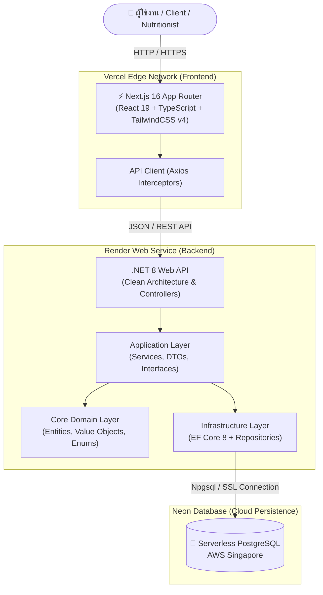

# 🥗 NutriPlan - ระบบจัดการโภชนาการและวางแผนมื้ออาหาร
### (Academic & Personal Nutrition Management System)

<div align="center">


**ระบบเว็บแอปพลิเคชันจัดการโภชนาการและวางแผนมื้ออาหาร พัฒนาด้วย Clean Architecture, Domain-Driven Design (DDD) และหลักการเขียนโปรแกรมเชิงวัตถุ (OOP)**

[🌐 เข้าใช้งานเว็บไซต์จริง (Frontend บน Vercel)](https://nutri-plan-chi-two.vercel.app) • [⚙️ Backend API (Render)](https://nutriplan-b3i6.onrender.com/api/v1/food-items)

---

**[ 🇹🇭 ภาษาไทย (หลัก) ]** | **[ 🇬🇧 English Summary ]**

</div>

---

# 🇹🇭 ส่วนที่ 1: ข้อมูลภาษาไทย (หลัก)

## 📌 ภาพรวมโปรเจกต์ (Project Overview)

**NutriPlan** เป็นเว็บแอปพลิเคชันระดับองค์กรที่ออกแบบและพัฒนาขึ้นเพื่อแก้ปัญหาการติดตามโภชนาการส่วนบุคคลและการวางแผนอาหารโดยนักโภชนาการมืออาชีพ ระบบช่วยให้ผู้ใช้งานทั่วไปและผู้รับบริการ (**Clients**) สามารถบันทึกมื้ออาหาร คำนวณพลังงานที่ร่างกายต้องการต่อวัน (BMR / TDEE) ติดตามน้ำหนัก และรับแผนการกินอาหารที่จัดทำโดยนักโภชนาการ (**Nutritionist**)

โปรเจกต์นี้ถูกออกแบบโดยใช้ **Clean Architecture** ร่วมกับหลักการ **SOLID Principles** และเลือกใช้ Design Patterns ที่เหมาะสม เช่น **Repository & Unit of Work Pattern**, **Factory Method Pattern**, และ **Dependency Inversion Principle**

---

## 🚀 ลิงก์ระบบออนไลน์ & บัญชีผู้ใช้สำหรับทดสอบ

### 🔗 ลิงก์ระบบจริง (Live Demo)
- **Frontend (Vercel):** [https://nutri-plan-chi-two.vercel.app](https://nutri-plan-chi-two.vercel.app)
- **Backend API (Render):** `https://nutriplan-b3i6.onrender.com/api/v1`
- **Database (Neon Cloud):** Serverless PostgreSQL (Singapore Region)

### 🔑 บัญชีทดสอบระบบ (Test Accounts)

| บทบาท (Role) | อีเมล (Email) | รหัสผ่าน (Password) | สิทธิ์และการใช้งาน |
| :--- | :--- | :--- | :--- |
| **ลูกค้า (Client)** | `client@test.com` | `Password123!` | คำนวณ BMR/TDEE, บันทึกมื้ออาหารประจําวัน, ดูรายงานความต่อเนื่อง |
| **นักโภชนาการ (Nutritionist)** | `nutritionist@test.com` | `Password123!` | จัดการลูกค้า, สร้างแผนจัดมื้ออาหาร, ส่งออกรายการซื้อของ (Shopping List) |
| **ผู้ใช้ทั่วไป (General User)** | `user@test.com` | `Password123!` | จัดการโปรไฟล์ส่วนตัว และค้นหาข้อมูลคุณค่าทางโภชนาการของวัตถุดิบ |

---

## ✨ ฟีเจอร์หลักของระบบ (Key Features)

### 👤 1. ระบบจัดการสิทธิ์ผู้ใช้งาน (User Roles & Authentication)
- **Role-Based Access Control (RBAC):** กำหนดสิทธิ์ผู้ใช้งานด้วย JWT Token สำหรับ `Admin`, `Nutritionist`, และ `Client`
- **Client Assignment:** นักโภชนาการสามารถดึงลูกค้าเข้าดูแล และจัดแผนอาหารเฉพาะบุคคลได้

### 📊 2. เครื่องมือคำนวณพลังงานและสารอาหาร (BMR & TDEE Engines)
- **หลักการทางวิทยาศาสตร์:** ใช้สูตร Mifflin-St Jeor / Harris-Benedict ในการคำนวณ BMR และ TDEE ตามอายุ น้ำหนัก ส่วนสูง เพศ และระดับกิจกรรม
- **เป้าหมายสุขภาพ:** คำนวณเป้าหมายพลังงาน (ลดน้ำหนัก / คงน้ำหนัก / เพิ่มกล้ามเนื้อ)

### 🍽️ 3. ระบบสร้างแผนมื้ออาหาร (Meal Plan Generator)
- **การจัดเมนูอาหารหลายวัน:** กำหนดเป้าหมายแคลอรีและสัดส่วนสารอาหารหลัก (โปรตีน, คาร์โบไฮเดรต, ไขมัน, ไฟเบอร์)
- **ระบบแจ้งเตือนการแพ้อาหาร (Allergen Warning):** แจ้งเตือนอัตโนมัติหากวัตถุดิบมีส่วนผสมที่ลูกค้าแพ้

### 🛒 4. ระบบส่งออกรายการซื้อของ (Shopping List Exporter)
- รวมปริมาณวัตถุดิบที่ต้องใช้ตามแผนมื้ออาหาร และส่งออกเป็นรูปแบบ **PDF** หรือ **ข้อความ (Text)** โดยใช้ **Factory Method Pattern**

### 📈 5. ระบบติดตามและรายงานผล (Adherence Tracking)
- เปรียบเทียบอาหารที่วางแผนไว้กับอาหารที่รับประทานจริง คำนวณคะแนนความต่อเนื่อง (% Adherence) อัตโนมัติ

---

## 🏗️ สถาปัตยกรรมระบบ (System Architecture)



---

## 📐 การออกแบบเชิงวัตถุ & Clean Architecture (OOP & Design Patterns)

### 1. การแบ่ง Layer ตาม Clean Architecture (Onion Architecture)
- **`NutriPlan.Domain` (Core Layer):** เก็บ Business Entities (`User`, `Client`, `Nutritionist`, `MealPlan`, `DailyMenu`, `FoodItem`), Value Objects (`NutrientProfile`) และ Enums โดยไม่มี Dependency ภายนอก
- **`NutriPlan.Application`:** รวม Use Cases, DTOs และ Interfaces ของบริการ (`IMealPlanService`, `IAuthService`)
- **`NutriPlan.Infrastructure`:** ส่วนติดต่อฐานข้อมูลผ่าน EF Core 8, Repository Implementations, Migrations และการต่อสู้กับ Security
- **`NutriPlan.Api`:** Controllers รับส่ง REST API Request/Response และ DI Container Setup

### 2. Design Patterns ที่นำมาประยุกต์ใช้
- **Repository & Unit of Work Pattern:** แยก Logic การเข้าถึงฐานข้อมูลออกจาก Business Logic (`IUserRepository`, `IMealPlanRepository`, `IUnitOfWork`)
- **Factory Method Pattern:** สรุปรายการวัตถุดิบและสร้างรูปแบบเอกสาร Shopping List (`ShoppingListFactory` สำหรับ PDF และ Text)
- **Value Object Pattern:** สร้าง Class `NutrientProfile` ที่แก้ไขค่าไม่ได้ (Immutable) เพื่อคำนวณแคลอรีรวมและสารอาหาร
- **Dependency Inversion Principle (DIP):** ทุก Module สื่อสารกันผ่าน Interface และฉีด Dependency ผ่าน IoC Container ของ .NET 8

---

## 🛠️ เทคโนโลยีที่ใช้ (Tech Stack)

* **Frontend:** Next.js 16 (App Router), React 19, TypeScript 5, Tailwind CSS v4, Axios
* **Backend:** .NET 8 (ASP.NET Core Web API), Entity Framework Core 8, Npgsql, JWT Authentication, Docker
* **Database:** Serverless PostgreSQL 16 บน Neon Cloud (AWS Singapore)
* **Hosting:** Vercel (Frontend), Render (Backend)

---

## 💻 คู่มือการติดตั้งและรันโปรเจกต์ในเครื่อง (Local Setup)

### สิ่งที่ต้องเตรียมไว้ก่อน (Prerequisites)
- [.NET 8.0 SDK](https://dotnet.microsoft.com/download/dotnet/8.0)
- [Node.js 20+ และ npm](https://nodejs.org/)

### 1. Clone Repository
```bash
git clone https://github.com/6731470008-web/NutriPlan.git
cd NutriPlan
```

### 2. การตั้งค่า Backend (.NET API)
```bash
cd backend

# สั่ง Restore Package
dotnet restore

# รัน Migration เพื่อสร้างโครงสร้างฐานข้อมูล
dotnet ef database update --project src/Infrastructure/NutriPlan.Infrastructure --startup-project src/Infrastructure/NutriPlan.Api

# รัน Backend Server
dotnet run --project src/Infrastructure/NutriPlan.Api
```
*Backend จะรันที่ `http://localhost:5128`*

### 3. การตั้งค่า Frontend (Next.js)
```bash
cd ../frontend

# ติดตั้ง Node Modules
npm install

# รัน Development Server
npm run dev
```
*เปิดเว็บเบราว์เซอร์เข้าที่ `http://localhost:3001`*

---

<br/>

---

# 🇬🇧 Section 2: English Summary

## 📌 Executive Summary

**NutriPlan** is an enterprise-grade nutrition management platform built with **Clean Architecture**, **Domain-Driven Design (DDD)**, and **Object-Oriented Design (OOD)** principles. It allows general clients to track daily food intake and calculate precise caloric/macronutrient requirements (BMR/TDEE), while empowering professional Nutritionists to construct personalized multi-day meal plans and export dynamic shopping lists.

## 🚀 Public Deployment Links
- **Frontend App (Vercel):** [https://nutri-plan-chi-two.vercel.app](https://nutri-plan-chi-two.vercel.app)
- **Backend API (Render):** `https://nutriplan-b3i6.onrender.com/api/v1`
- **Database:** Neon Cloud Serverless PostgreSQL (Singapore Region)

## 🔑 Test Credentials
- **Client:** `client@test.com` / `Password123!`
- **Nutritionist:** `nutritionist@test.com` / `Password123!`
- **User:** `user@test.com` / `Password123!`

## 📐 Key Design Patterns & Software Engineering Principles
1. **Clean Architecture:** Strict isolation between Domain, Application, Infrastructure, and API layers.
2. **Repository & Unit of Work:** Decoupled data access logic for high testability.
3. **Factory Method Pattern:** Encapsulated shopping list export generation (PDF / Text formats).
4. **SOLID & DIP:** Complete interface-driven dependency injection across the codebase.

---

<div align="center">

Distributed under the **MIT License**. Created with ❤️ for Academic & Professional Software Engineering.

</div>
