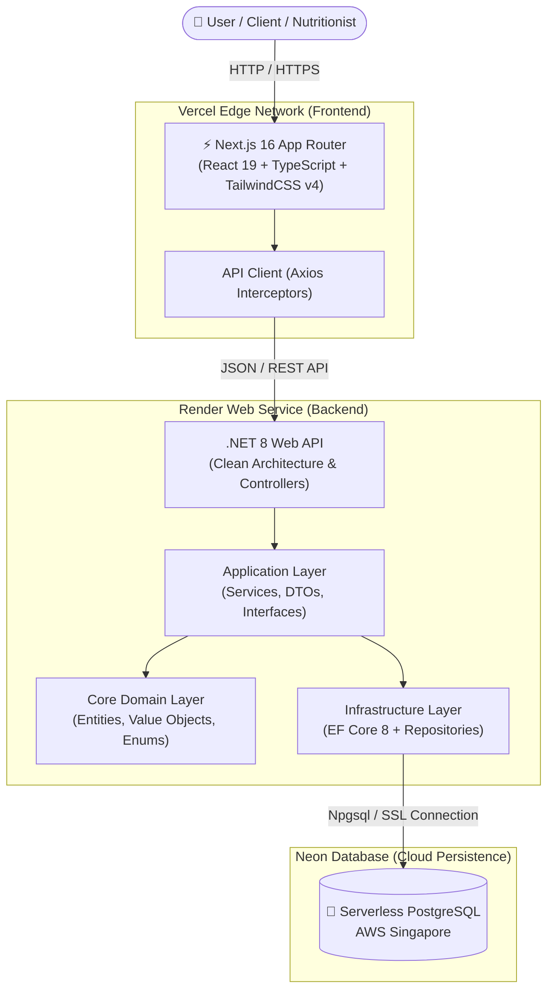

# 🥗 NutriPlan - Academic & Personal Nutrition Management System

<div align="center">


**A full-stack, enterprise-grade Nutrition & Meal Planning Platform built with Clean Architecture, Domain-Driven Design (DDD), and Object-Oriented Design (OOD) Principles.**

[🌐 Live Frontend Demo](https://nutri-plan-chi-two.vercel.app) • [⚙️ Live Backend API (Render)](https://nutriplan-b3i6.onrender.com/api/v1/food-items)

</div>

---

## 📌 Executive Summary

**NutriPlan** is an end-to-end web application engineered to solve real-world personal nutrition tracking and professional dietetics management challenges. It enables **Clients** to track daily meal logs, calculate precise caloric/macronutrient requirements (BMR/TDEE), monitor weight progress, and receive customized meal plans assigned by professional **Nutritionists**.

The platform is architected with modern **Clean Architecture**, adhering strictly to **SOLID Principles** and implementing design patterns such as **Repository & Unit of Work**, **Factory Method**, and **Dependency Injection**.

---

## 🚀 Live Demo & Access Credentials

### 🔗 Public Live URLs
- **Frontend App (Vercel):** [https://nutri-plan-chi-two.vercel.app](https://nutri-plan-chi-two.vercel.app)
- **Backend API (Render):** `https://nutriplan-b3i6.onrender.com/api/v1`
- **Database (Neon Cloud):** Serverless PostgreSQL (Singapore Region)

### 🔑 Demo Test Accounts

| Role | Email | Password | Features & Permissions |
| :--- | :--- | :--- | :--- |
| **Client / User** | `client@test.com` | `Password123!` | Body metrics calculation, Daily meal logging, Progress tracking |
| **Nutritionist** | `nutritionist@test.com` | `Password123!` | Client assignment, Custom meal plan creation, Shopping list export |
| **General User** | `user@test.com` | `Password123!` | Standard user profile & food catalog exploration |

---

## ✨ Key Features

### 👤 User Role Hierarchy & Authentication
- **Role-Based Access Control (RBAC):** JWT-authenticated authorization for `Admin`, `Nutritionist`, and `Client`.
- **Client-Nutritionist Mapping:** Nutritionists can manage assigned client lists and design specialized diets.

### 📊 Caloric & Macronutrient Engines (BMR / TDEE)
- **Scientific Calculations:** Implements Mifflin-St Jeor / Harris-Benedict formulas based on Age, Gender, Height, Weight, and Activity Level.
- **Goal Target Monitoring:** Dynamic calculation of caloric surplus/deficit for Weight Loss, Maintenance, or Muscle Gain goals.

### 🍽️ Meal Plan & Daily Menu Generator
- **Multi-Day Meal Plan Construction:** Create custom meal plans with daily calorie targets and macronutrient distributions (Protein, Carbs, Fat, Fiber).
- **Allergen Alert System:** Automated warnings for food items containing registered client allergens.

### 🛒 Shopping List Exporter (Factory Pattern)
- Multi-format exporter (PDF / Text) that consolidates ingredient quantities across active meal plans, scaling portions automatically.

### 📈 Adherence Reporting & Progress Tracking
- Compare planned vs. actual food portion intake with automatic compliance scoring (% adherence).

---

## 🏗️ System Architecture



---

## 📐 Object-Oriented Design & Architectural Patterns

### 1. Clean Architecture (Onion Architecture)
The backend project is segregated into distinct layers to enforce separation of concerns:
- `NutriPlan.Domain`: Pure business entities (`User`, `Client`, `Nutritionist`, `MealPlan`, `DailyMenu`, `FoodItem`), Value Objects (`NutrientProfile`), and Enums. No external dependencies.
- `NutriPlan.Application`: Use cases, DTOs, Service Interfaces (`IMealPlanService`, `IAuthService`).
- `NutriPlan.Infrastructure`: Entity Framework Core DbContext, Migrations, Repository Implementations, Security & Database Seeding.
- `NutriPlan.Api`: ASP.NET Core Web API Controllers, Middleware, Dependency Injection Setup.

### 2. Design Patterns Applied
- **Repository & Unit of Work Pattern:** Decouples data access from business logic (`IUserRepository`, `IMealPlanRepository`, `IUnitOfWork`).
- **Factory Method Pattern:** Encapsulates shopping list export logic (`ShoppingListFactory` creating PDF or Text formatted output).
- **Value Object Pattern:** Implemented immutable `NutrientProfile` for encapsulating calories, protein, carbs, fat, and fiber logic.
- **Dependency Inversion Principle (DIP):** All services communicate exclusively through interfaces, registered via standard ASP.NET Core IoC container.

---

## 🛠️ Technology Stack

### **Frontend**
- **Framework:** Next.js 16 (App Router) & React 19
- **Language:** TypeScript 5
- **Styling:** Tailwind CSS v4 & Vanilla CSS
- **HTTP Client:** Axios with dynamic JWT interceptors
- **Hosting:** Vercel Edge Network

### **Backend**
- **Framework:** .NET 8 (ASP.NET Core Web API)
- **ORM:** Entity Framework Core 8 (EF Core)
- **Database Driver:** Npgsql PostgreSQL Provider
- **Authentication:** JSON Web Tokens (JWT Bearer)
- **Containerization:** Docker (Multi-stage build)
- **Hosting:** Render.com Cloud Platform

### **Database**
- **Engine:** Serverless PostgreSQL 16
- **Hosting:** Neon.tech (AWS Singapore Region)

---

## 💻 Local Development Setup

### Prerequisites
- [.NET 8.0 SDK](https://dotnet.microsoft.com/download/dotnet/8.0)
- [Node.js 20+ & npm](https://nodejs.org/)
- [PostgreSQL Database](https://www.postgresql.org/) (or use Neon Cloud connection string)

### 1. Clone Repository
```bash
git clone https://github.com/6731470008-web/NutriPlan.git
cd NutriPlan
```

### 2. Backend Setup (.NET API)
```bash
cd backend

# Restore dependencies
dotnet restore

# Apply EF Core migrations to database
dotnet ef database update --project src/Infrastructure/NutriPlan.Infrastructure --startup-project src/Infrastructure/NutriPlan.Api

# Start backend server
dotnet run --project src/Infrastructure/NutriPlan.Api
```
The API will run locally at `http://localhost:5128`.

### 3. Frontend Setup (Next.js)
```bash
cd ../frontend

# Install node dependencies
npm install

# Run Next.js dev server
npm run dev
```
Open [http://localhost:3001](http://localhost:3001) in your browser.

---

## 📄 License

Distributed under the **MIT License**. See `LICENSE` for more information.

<div align="center">

Developed with ❤️ for Academic & Professional Excellence in Object-Oriented Software Engineering.

</div>
