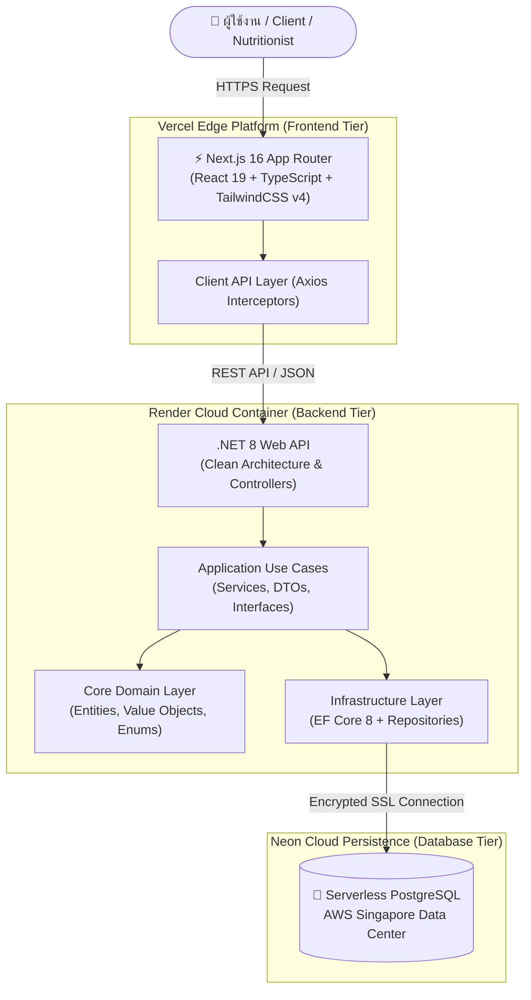

# 🥗 NutriPlan
### Enterprise Nutrition & Meal Planning Platform
*(ระบบจัดการโภชนาการและวางแผนมื้ออาหารระดับองค์กร)*

<div align="center">


<br/>

[🌐 เข้าสู่ระบบจริง (Live Frontend)](https://nutri-plan-chi-two.vercel.app) • [⚙️ API Endpoint (Render)](https://nutriplan-b3i6.onrender.com/api/v1/food-items) • [📂 GitHub Repository](https://github.com/6731470008-web/NutriPlan)

<br/>

**[ 🇹🇭 ภาษาไทย ]** | **[ 🇬🇧 English ]**

---

</div>

<br/>

# 🇹🇭 ภาษาไทย

## 📌 บทนำและวัตถุประสงค์ของระบบ

**NutriPlan** คือแพลตฟอร์มจัดการโภชนาการและวางแผนมื้ออาหารแบบครบวงจร ออกแบบมาเพื่อยกระดับการดูแลสุขภาพส่วนบุคคลและการทำงานของนักโภชนาการมืออาชีพ ระบบช่วยแก้ปัญหาความซับซ้อนในการคำนวณพลังงาน สารอาหารหลัก (Macronutrients) การจัดรายการอาหารที่สอดคล้องกับข้อจำกัดด้านสุขภาพ และการติดตามความต่อเนื่องในการรับประทานอาหารของผู้ใช้

โปรเจกต์นี้ได้รับการพัฒนาภายใต้สถาปัตยกรรม **Clean Architecture (Onion Architecture)** ร่วมกับหลักการ **SOLID Principles** และ **Domain-Driven Design (DDD)** โดยมีการนำเสนอการประยุกต์ใช้ **Object-Oriented Design (OOD)** และ **Design Patterns** ระดับสูง เพื่อให้โค้ดมีความยืดหยุ่น รองรับการขยายตัว (Scalability) และมีประสิทธิภาพสูง

---

## 🌐 ลิงก์ระบบออนไลน์ (Live Deployments)

* **Frontend Application (Vercel):** [https://nutri-plan-chi-two.vercel.app](https://nutri-plan-chi-two.vercel.app)
* **Backend RESTful API (Render):** `https://nutriplan-b3i6.onrender.com/api/v1`
* **Cloud Database (Neon PostgreSQL):** Serverless PostgreSQL (Singapore Data Center)

---

## ✨ ฟีเจอร์และความสามารถหลัก

### 🔐 1. ระบบยืนยันตัวตนและการจัดการสิทธิ์ (Authentication & RBAC)
* ยืนยันตัวตนด้วย **JSON Web Token (JWT)** พร้อมระบบจำแนกสิทธิ์ตามบทบาท (Role-Based Access Control)
* รองรับโครงสร้างผู้ใช้ตามลำดับขั้น (User Hierarchy: Admin, Nutritionist, Client)

### 🧮 2. เครื่องมือคำนวณโภชนาการตามหลักวิทยาศาสตร์ (BMR & TDEE Engine)
* คำนวณอัตราการเผาผลาญพื้นฐาน (BMR) และพลังงานที่ใช้ต่อวัน (TDEE) ด้วยสูตร **Mifflin-St Jeor** และ **Harris-Benedict**
* ปรับแต่งเป้าหมายพลังงานอัตโนมัติ (Calorie Target) ตามวัตถุประสงค์ (ลดน้ำหนัก / คงน้ำหนัก / เพิ่มมวลกล้ามเนื้อ)

### 📋 3. ระบบจัดทำแผนอาหารและเมนูประจำวัน (Dynamic Meal Plan Generator)
* สร้างแผนอาหารแบบหลายวัน (Multi-Day Meal Plan) พร้อมกำหนดสัดส่วนสารอาหาร โปรตีน คาร์โบไฮเดรต ไขมัน และไฟเบอร์
* ระบบคัดกรองและแจ้งเตือนวัตถุดิบที่เป็นอันตรายต่อผู้ที่มีอาการแพ้อาหาร (Smart Allergen Detection)

### 🛍️ 4. ระบบสรุปและส่งออกรายการวัตถุดิบ (Automated Shopping List Aggregator)
* คำนวณรวมปริมาณวัตถุดิบที่ต้องใช้จากแผนอาหารทั้งหมดโดยอัตโนมัติ
* ส่งออกเอกสารได้หลายรูปแบบ (PDF / Text) ผ่านการประยุกต์ใช้ **Factory Method Pattern**

### 📊 5. ระบบติดตามและวิเคราะห์พฤติกรรม (Adherence Tracking & Analytics)
* บันทึกปริมาณอาหารที่รับประทานจริงเปรียบเทียบกับแผนงาน
* ประเมินและคำนวณคะแนนความต่อเนื่อง (% Adherence Score) พร้อมรายงานผลการปฏิบัติตนตามแผนอาหาร

---

## 🏗️ ผังแสดงสถาปัตยกรรมระบบ (System Architecture)



---

## 📐 การออกแบบเชิงวัตถุและสถาปัตยกรรมซอฟต์แวร์ (OOD & Architecture)

### 1. โครงสร้าง Clean Architecture (4-Tier Layering)
* **`NutriPlan.Domain`:** ชั้นในสุดที่เป็นศูนย์กลางของ Business Logic ประกอบด้วย Core Entities (`User`, `Client`, `Nutritionist`, `MealPlan`, `DailyMenu`, `FoodItem`), Value Objects (`NutrientProfile`) และ Enums โดยไม่มี Dependency ต่อ Library ภายนอก
* **`NutriPlan.Application`:** รวม Use Cases ของระบบ, Data Transfer Objects (DTOs) และ Interfaces ของ Service (`IMealPlanService`, `IAuthService`)
* **`NutriPlan.Infrastructure`:** การจัดการข้อมูลผ่าน Entity Framework Core 8, Repository Pattern, Database Migrations และระบบรักษาความปลอดภัย
* **`NutriPlan.Api`:** RESTful Controllers, Middleware จัดการ Exception และการลงทะเบียน Dependency Injection (DI)

### 2. Design Patterns ที่นำมาประยุกต์ใช้ในระบบ
* **Repository & Unit of Work Pattern:** แยกส่วนประสานข้อมูล (Data Access) ออกจาก Business Logic ช่วยให้โค้ดสามารถทำการ Unit Test ได้อย่างอิสระ
* **Factory Method Pattern:** ออกแบบ `ShoppingListFactory` สำหรับสร้างวัตถุในการส่งออกข้อมูล Shopping List เป็นรูปแบบเอกสารที่หลากหลาย (PDF / Text)
* **Value Object Pattern:** สร้าง `NutrientProfile` เป็นแบบ Immutable เพื่อเก็บและคำนวณค่าสารอาหารอย่างถูกต้องปลอดภัยจากการแก้ไขโดยไม่ได้รับอนุญาต
* **Dependency Inversion Principle (DIP):** การออกแบบให้ทุก Component ขึ้นอยู่กับ Abstraction (Interfaces) ทำการ Inject ผ่าน IoC Container ของ .NET 8

---

## 🛠️ เทคโนโลยีที่เลือกใช้ (Technology Stack)

| ส่วนประกอบ (Component) | เทคโนโลยีหลัก (Tech Stack) | รายละเอียด |
| :--- | :--- | :--- |
| **Frontend UI Framework** | **Next.js 16 (React 19)** | App Router, TypeScript 5, Tailwind CSS v4 |
| **Backend API Engine** | **.NET 8 (ASP.NET Core)** | C#, Clean Architecture, Entity Framework Core 8 |
| **Database System** | **PostgreSQL 16** | Serverless Architecture บน Neon Cloud (AWS Singapore) |
| **Authentication & Security** | **JWT Bearer Token** | Role-Based Access Control (RBAC), Password Hashing |
| **Deployment & Hosting** | **Vercel & Render** | Frontend บน Vercel Edge Network / Backend Docker บน Render |

---

## 💻 คู่มือการติดตั้งและเปิดใช้งานในเครื่อง (Local Setup)

### ข้อกำหนดเบื้องต้น (Prerequisites)
* [.NET 8.0 SDK](https://dotnet.microsoft.com/download/dotnet/8.0)
* [Node.js 20+ และ npm](https://nodejs.org/)

### 1. ดาวน์โหลดซอร์สโค้ด (Clone Repository)
```bash
git clone https://github.com/6731470008-web/NutriPlan.git
cd NutriPlan
```

### 2. การติดตั้งและรันระบบ Backend (.NET API)
```bash
cd backend

# สั่ง Restore Package Dependencies
dotnet restore

# รัน EF Core Migration เพื่อสร้างโครงสร้างตาราง
dotnet ef database update --project src/Infrastructure/NutriPlan.Infrastructure --startup-project src/Infrastructure/NutriPlan.Api

# สั่งรัน Backend Server
dotnet run --project src/Infrastructure/NutriPlan.Api
```
*Backend API จะพร้อมใช้งานที่: `http://localhost:5128`*

### 3. การติดตั้งและรันระบบ Frontend (Next.js)
```bash
cd ../frontend

# ติดตั้ง Node Modules
npm install

# รัน Development Server
npm run dev
```
*เปิดใช้งานหน้าเว็บได้ที่: `http://localhost:3001`*

---

<br/>
<br/>

# 🇬🇧 English

## 📌 System Overview & Vision

**NutriPlan** is an enterprise-grade nutrition management platform designed to revolutionize personal health tracking and professional dietetic planning. The platform solves the underlying complexity of caloric calculations, macronutrient balancing, health-specific dietary constraint management, and client adherence tracking.

Architected using **Clean Architecture (Onion Architecture)**, **Domain-Driven Design (DDD)**, and **SOLID Principles**, NutriPlan showcases advanced **Object-Oriented Design (OOD)** and **Design Patterns** ensuring maintainability, high testability, and seamless scalability.

---

## 🌐 Public Live Deployments

* **Frontend Web Application (Vercel):** [https://nutri-plan-chi-two.vercel.app](https://nutri-plan-chi-two.vercel.app)
* **Backend RESTful API (Render):** `https://nutriplan-b3i6.onrender.com/api/v1`
* **Cloud Database (Neon PostgreSQL):** Serverless PostgreSQL (Singapore Data Center)

---

## ✨ Core Platform Capabilities

### 🔐 1. Authentication & Role-Based Access Control (RBAC)
* Secure authentication backed by **JSON Web Tokens (JWT)**.
* Domain-driven User Hierarchy supporting `Admin`, `Nutritionist`, and `Client` permissions.

### 🧮 2. Scientific Caloric & Macronutrient Engine (BMR & TDEE)
* Implements **Mifflin-St Jeor** and **Harris-Benedict** equations based on age, gender, height, weight, and activity metrics.
* Dynamic target calorie adjustments for Weight Loss, Maintenance, or Muscle Building.

### 📋 3. Dynamic Meal Plan & Daily Menu Builder
* Multi-day meal plan orchestration with targeted macronutrient distribution (Protein, Carbs, Fat, Fiber).
* **Smart Allergen Detection** triggering warnings when food items conflict with client allergies.

### 🛍️ 4. Automated Shopping List Aggregator (Factory Pattern)
* Aggregates total ingredient requirements across meal plans.
* Multi-format document generation (PDF / Text) driven by the **Factory Method Pattern**.

### 📊 5. Adherence Analytics & Progress Monitoring
* Real-time comparison between planned vs. actual consumed portions.
* Automated compliance calculation (% Adherence Score) with historical logging.

---

## 📐 Object-Oriented Engineering & Architecture Showcase

### 1. Clean Architecture Breakdown (4-Tier)
* **`NutriPlan.Domain`:** Pure business domain containing core entities (`User`, `Client`, `Nutritionist`, `MealPlan`, `DailyMenu`, `FoodItem`), immutable Value Objects (`NutrientProfile`), and Enums with zero external dependencies.
* **`NutriPlan.Application`:** Application use-cases, Data Transfer Objects (DTOs), and service abstractions (`IMealPlanService`, `IAuthService`).
* **`NutriPlan.Infrastructure`:** Data persistence powered by Entity Framework Core 8, Repository implementations, database migrations, and security.
* **`NutriPlan.Api`:** ASP.NET Core RESTful controllers, global exception middleware, and Dependency Injection wiring.

### 2. Design Patterns Implemented
* **Repository & Unit of Work Pattern:** Decouples business logic from data access (`IUserRepository`, `IMealPlanRepository`, `IUnitOfWork`).
* **Factory Method Pattern:** `ShoppingListFactory` encapsulates document creation for PDF and Text outputs.
* **Value Object Pattern:** `NutrientProfile` provides immutable macronutrient encapsulation.
* **Dependency Inversion Principle (DIP):** Abstraction-driven architecture backed by .NET 8 IoC container.

---

## 🛠️ Complete Technical Stack

| Tier | Technologies |
| :--- | :--- |
| **Frontend** | Next.js 16 (App Router), React 19, TypeScript 5, Tailwind CSS v4, Axios |
| **Backend** | .NET 8 (ASP.NET Core Web API), C#, Entity Framework Core 8, Npgsql, JWT |
| **Database** | Serverless PostgreSQL 16 on Neon Cloud (AWS Singapore Data Center) |
| **Hosting & DevOps** | Vercel (Frontend Edge Network), Render (Backend Container Docker Service) |

---

## 💻 Local Developer Quickstart

```bash
# 1. Clone repository
git clone https://github.com/6731470008-web/NutriPlan.git
cd NutriPlan

# 2. Setup & Run Backend (.NET 8)
cd backend
dotnet restore
dotnet ef database update --project src/Infrastructure/NutriPlan.Infrastructure --startup-project src/Infrastructure/NutriPlan.Api
dotnet run --project src/Infrastructure/NutriPlan.Api

# 3. Setup & Run Frontend (Next.js 16)
cd ../frontend
npm install
npm run dev
```

---

<div align="center">

Distributed under the **MIT License**. Engineered with ❤️ for Academic & Professional Excellence in Software Engineering.

</div>
