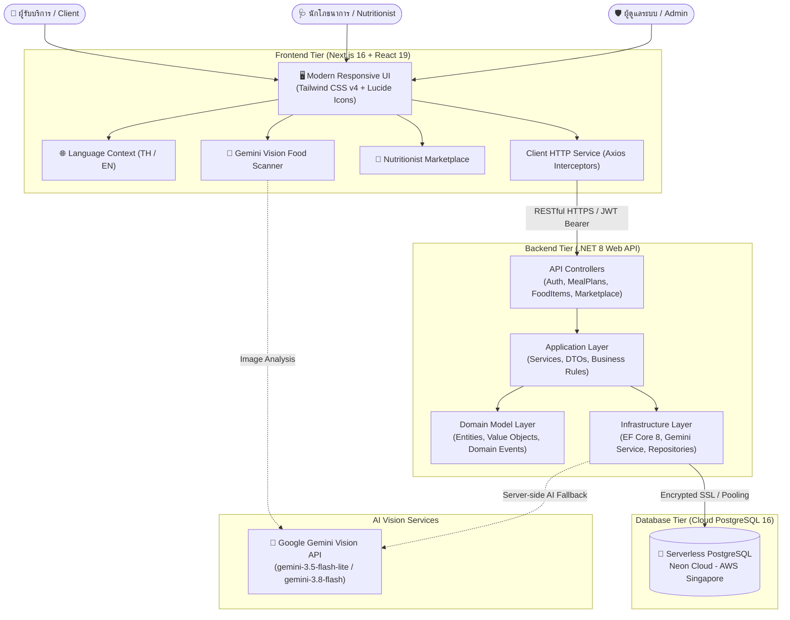
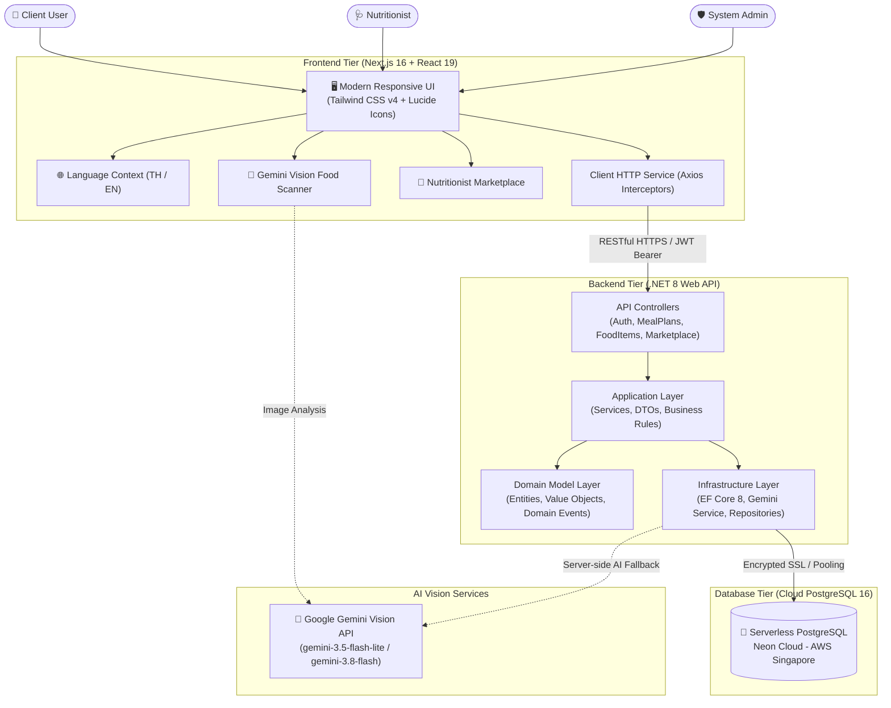

# 🥗 NutriPlan
### Enterprise Nutrition & Dietetic Management Platform
*(แพลตฟอร์มจัดการโภชนาการ วางแผนมื้ออาหาร และจับคู่นักโภชนาการระดับองค์กร)*

<div align="center">


<br/>

[🌐 เข้าสู่ระบบจริง (Live Web App)](https://nutri-plan-chi-two.vercel.app) • [⚙️ Backend API Service (Render)](https://nutriplan-b3i6.onrender.com/api/v1/food-items) • [📂 GitHub Repository](https://github.com/6731470008-web/NutriPlan)

<br/>

**[ 🇹🇭 ภาษาไทย ](#-ภาษาไทย)** | **[ 🇬🇧 English ](#-english)**

---

</div>

<br/>

# 🇹🇭 ภาษาไทย

## 📌 บทนำและภาพรวมของระบบ (System Overview)

**NutriPlan** คือแพลตฟอร์มบริหารจัดการโภชนาการ การจัดทำแผนมื้ออาหาร และตลาดบริการปรึกษาด้านสุขภาพ (Nutritionist Marketplace) แบบครบวงจร ออกแบบและพัฒนาเพื่อยกระดับการดูแลสุขภาพส่วนบุคคลและการทำงานของนักโภชนาการมืออาชีพ

ระบบถูกพัฒนาขึ้นตามมาตรฐานวิศวกรรมซอฟต์แวร์ระดับสากล ภายใต้สถาปัตยกรรม **Clean Architecture (Onion Architecture)** ร่วมกับหลักการ **SOLID Principles**, **Domain-Driven Design (DDD)** และ **Object-Oriented Design (OOD)** พร้อมทั้งเชื่อมต่อกับเทคโนโลยี **ปัญญาประดิษฐ์ (AI Computer Vision - Google Gemini)** ในการจำแนกอาหารและคำนวณโภชนาการจากภาพถ่ายแบบ Real-time

---

## 🌐 ลิงก์ระบบออนไลน์ (Live Deployments)

* **Frontend Web Application (Vercel Edge Network):** [https://nutri-plan-chi-two.vercel.app](https://nutri-plan-chi-two.vercel.app)
* **Backend RESTful API (.NET 8 on Render Cloud Container):** `https://nutriplan-b3i6.onrender.com/api/v1`
* **Production Database (Neon PostgreSQL 16):** Serverless PostgreSQL บน AWS Data Center (Singapore)

---

## 🔑 ข้อมูลบัญชีผู้ดูแลระบบเริ่มต้น (Default System Account)

ระบบได้รับการล้างข้อมูล Mock Data และพร้อมสำหรับการใช้งานจริง สามารถเข้าสู่ระบบด้วยบัญชีผู้ดูแลระบบ (Admin) หรือสมัครสมาชิกใหม่ได้ทันที:

| บทบาท (Role) | อีเมล (Email) | รหัสผ่าน (Password) | สิทธิ์และความสามารถหลัก |
| :--- | :--- | :--- | :--- |
| **System Admin** | `admin@admin.com` | `00000000` | จัดการผู้ใช้ทั้งหมด, ควบคุมคลังรายการอาหาร (Food Items), ตรวจสอบสถิติระบบ |
| **สมาชิกใหม่ (New User)** | *ลงทะเบียนผ่านหน้าเว็บ* | *กำหนดเอง* | เลือกลงทะเบียนเป็น **ผู้รับบริการ (Client)** หรือ **นักโภชนาการ (Nutritionist)** พร้อมเลือกแพ็กเกจ (Free / Pro) |

---

## ✨ ฟีเจอร์และความสามารถหลักของระบบ (Core Capabilities)

### 🏪 1. ตลาดจับคู่นักโภชนาการและระบบปรึกษาสุขภาพ (Nutritionist Marketplace & Consultation)
* **ค้นหาและคัดกรองผู้เชี่ยวชาญ:** คัดกรองตามความเชี่ยวชาญ (ลดน้ำหนัก, เพิ่มกล้ามเนื้อ, เบาหวาน/โรคเรื้อรัง, มังสวิรัติ, โภชนาการกีฬา), ภาษา และเรตติ้ง
* **ระบบจัดอันดับสิทธิประโยชน์ระดับโปร (Pro Priority Placement):** นักโภชนาการระดับ **Pro / Verified Partner** จะได้รับการจัดอันดับให้อยู่ในตำแหน่งแรก พร้อมป้ายสัญลักษณ์รับรองความน่าเชื่อถือ
* **การจองและนัดหมายคำปรึกษา:** ผู้รับบริการสามารถเลือกประเภทการปรึกษา (แชท 1 ต่อ 1, วิดีโอคอล, จัดแผนอาหารเฉพาะบุคคล) และส่งคำขอปรึกษาได้ทันที
* **ระบบติดตามสถานะคำขอ (Consultation Lifecycle):** จัดการคำขอตั้งแต่ *รอดำเนินการ (Pending)*, *ตอบรับแล้ว (Approved)*, *กำลังดำเนินการ (In Progress)* ไปจนถึง *เสร็จสิ้น (Completed)* พร้อมระบบให้คะแนนรีวิว (Review & Ratings)

### 📸 2. ระบบสแกนและวิเคราะห์อาหารด้วย AI (Google Gemini Vision AI Engine)
* **จำแนกอาหารจากภาพถ่ายความแม่นยำสูง:** ถ่ายภาพสดจากกล้องสมาร์ตโฟนหรืออัปโหลดรูปภาพอาหารและเครื่องดื่ม
* **รองรับอาหารไทยและอาหารสุขภาพเฉพาะทาง:** ตรวจจับและวิเคราะห์เมนูยอดนิยมได้อย่างแม่นยำ เช่น อกไก่ปั่น, เวย์โปรตีนเชค, เมนูอาหารคลีน, สเต๊ก, ต้มยำ, ข้าวผัด ฯลฯ
* **แจกแจงสารอาหารและส่วนประกอบ (Decomposition):** วิเคราะห์แคลอรีรวม, โปรตีน, คาร์โบไฮเดรต, ไขมัน และแจกแจงส่วนประกอบย่อยในจานพร้อมค่าน้ำหนักโดยประมาณและระดับความเชื่อมั่น (Confidence Score)
* **Smart Auto-Fill to Meal Plan:** บันทึกผลลัพธ์จากการสแกนเข้าสู่แผนมื้ออาหารในวันนั้น ๆ ได้ทันทีในคลิกเดียว

### 📋 3. ระบบจัดทำและบริหารจัดการแผนโภชนาการ (Dynamic Meal Plan Management)
* **การวางแผนอาหารแบบหลายวัน (Multi-Day Planning):** กำหนดเป้าหมายพลังงานและสารอาหารในแต่ละมื้อ (เช้า, ว่างเช้า, กลางวัน, ว่างบ่าย, เย็น)
* **สิทธิ์การปรับแต่งของลูกค้า (Client Self-Management):** ลูกค้าสามารถเพิ่มเมนูที่รับประทานจริง หรือสแกนอาหารเพิ่มเข้าสู่บันทึกประจำวันได้อย่างอิสระ
* **ระบบตรวจจับสารก่อภูมิแพ้อัจฉริยะ (Smart Allergen Detection):** ตรวจสอบวัตถุดิบเทียบกับประวัติการแพ้อาหารของผู้ใช้ และแจ้งเตือนอัตโนมัติหากพบความเสี่ยง

### 🌐 4. ระบบรองรับ 2 ภาษาเต็มรูปแบบ (100% Real-Time Bilingual TH / EN)
* สลับภาษาระหว่าง **ภาษาไทย** และ **English** ได้แบบ Real-time ตลอดการใช้งานผ่าน React `LanguageContext`
* ครอบคลุมทุกหน้าของระบบ: หน้าแรก, เข้าสู่ระบบ/สมัครสมาชิก, ตลาดนักโภชนาการ, แดชบอร์ดทุกบทบาท, หน้ารายละเอียดแผนอาหาร และคลังเทมเพลต

### 🧮 5. เครื่องมือคำนวณโภชนาการและติดตามพฤติกรรม (Nutrition Science & Tracking)
* **BMR & TDEE Scientific Engine:** คำนวณอัตราการเผาผลาญพื้นฐานด้วยสูตร **Mifflin-St Jeor** และ **Harris-Benedict** ปรับตามเป้าหมาย (ลดน้ำหนัก / รักษาน้ำหนัก / เพิ่มกล้ามเนื้อ)
* **Adherence Tracking:** ติดตามการรับประทานอาหารจริงเปรียบเทียบกับเป้าหมาย พร้อมคำนวณคะแนนความต่อเนื่อง (% Adherence Score)
* **Automated Shopping List:** รวมรายการและปริมาณวัตถุดิบที่ต้องซื้อจากแผนอาหารทั้งหมด และส่งออกเอกสารได้หลายฟอร์แมต

### ⌚ 6. ระบบเชื่อมต่อนาฬิกาและอุปกรณ์ออกกำลังกาย (Smartwatch & Fitness Wearables via Terra Aggregator)
* **รองรับอุปกรณ์ยอดนิยมทุกค่าย:** เชื่อมต่อและซิงก์ข้อมูลจาก **Garmin, Apple Watch, Fitbit, Samsung Health, Oura Ring, Whoop, Polar, Withings** ผ่านมาตรฐาน Unified Health Aggregator
* **Dynamic Real-Time TDEE:** นำแคลอรี่ที่เผาผลาญจริงจากการออกกำลังกาย (Active Calories Burned) มาปรับคำนวณโควตาพลังงานประจำวันอัตโนมัติ
* **Biometrics Tracking:** ซิงก์ก้าวเดิน (Steps), อัตราการเต้นของหัวใจ (Heart Rate), และชั่วโมงการนอนหลับ (Sleep Recovery) แสดงผลควบคู่กับสถิติสารอาหารบนแดชบอร์ด
* **Built-in Sandbox & Interactive Simulator:** มีระบบจำลองการซิงก์ข้อมูลในตัวเพื่อทดสอบระบบได้ทันทีโดยไม่ต้องรออนุมัติสิทธิ์อุปกรณ์กายภาพจริง


---

## 🏗️ สถาปัตยกรรมระบบ (System Architecture)


```mermaid
graph TD
    ClientUser([📱 ผู้รับบริการ / Client])
    NutriUser([🩺 นักโภชนาการ / Nutritionist])
    AdminUser([🛡️ ผู้ดูแลระบบ / Admin])
    
    subgraph "Frontend Tier (Next.js 16 + React 19)"
        UI["🖥️ Modern Responsive UI<br/>(Tailwind CSS v4 + Lucide Icons)"]
        Lang["🌐 Language Context (TH / EN)"]
        Scanner["📸 Gemini Vision Food Scanner"]
        Market["🏪 Nutritionist Marketplace"]
        AxiosClient["Client HTTP Service (Axios Interceptors)"]
    end

    subgraph "AI Vision Services"
        GeminiAPI["🤖 Google Gemini Vision API<br/>(gemini-3.5-flash-lite / gemini-3.8-flash)"]
    end
    
    subgraph "Backend Tier (.NET 8 Web API)"
        Controllers["API Controllers<br/>(Auth, MealPlans, FoodItems, Marketplace)"]
        AppUseCases["Application Layer<br/>(Services, DTOs, Business Rules)"]
        DomainCore["Domain Model Layer<br/>(Entities, Value Objects, Domain Events)"]
        InfraEF["Infrastructure Layer<br/>(EF Core 8, Gemini Service, Repositories)"]
    end
    
    subgraph "Database Tier (Cloud PostgreSQL 16)"
        PostgresDB[(🐘 Serverless PostgreSQL<br/>Neon Cloud - AWS Singapore)]
    end

    ClientUser --> UI
    NutriUser --> UI
    AdminUser --> UI
    UI --> Lang
    UI --> Scanner
    UI --> Market
    Scanner -.->|Image Analysis| GeminiAPI
    UI --> AxiosClient
    AxiosClient -->|RESTful HTTPS / JWT Bearer| Controllers
    Controllers --> AppUseCases
    AppUseCases --> DomainCore
    AppUseCases --> InfraEF
    InfraEF -.->|Server-side AI Fallback| GeminiAPI
    InfraEF -->|Encrypted SSL / Pooling| PostgresDB
```

---

## 📐 การออกแบบเชิงวัตถุและสถาปัตยกรรมซอฟต์แวร์ (OOD & Clean Architecture)

โปรเจกต์ NutriPlan ถูกออกแบบตามโครงสร้าง **Clean Architecture** แบ่งออกเป็น 4 เลเยอร์หลัก:

```
NutriPlan/
├── backend/
│   ├── src/
│   │   ├── Core/
│   │   │   ├── NutriPlan.Domain/            # Enterprise Business Rules (Entities, Value Objects, Enums)
│   │   │   └── NutriPlan.Application/       # Application Business Rules (Use Cases, DTOs, Interfaces)
│   │   └── Infrastructure/
│   │       ├── NutriPlan.Infrastructure/    # Data Access (EF Core 8, DB Migrations, AI Integrations)
│   │       └── NutriPlan.Api/               # REST API Controllers, Middlewares, DI Setup
│   └── tests/
│       └── NutriPlan.Domain.Tests/          # Unit Tests for Core Domain Logic
└── frontend/
    ├── src/
    │   ├── app/                             # Next.js 16 App Router (Pages & Routes)
    │   ├── components/                      # Reusable UI Components & Modals
    │   ├── context/                         # AuthContext & LanguageContext
    │   ├── services/                        # API Client Services (Axios)
    │   └── types/                           # TypeScript Interfaces & Models
```

### Design Patterns ที่ประยุกต์ใช้ในระบบ
1. **Repository & Unit of Work Pattern:** แยกกระบวนการเข้าถึงฐานข้อมูลออกจาก Business Logic เพื่อความยืดหยุ่นและการทำ Unit Test ที่มีประสิทธิภาพ
2. **Factory Method Pattern:** ใช้งานใน `ShoppingListFactory` สำหรับสร้างเอกสารสรุปวัตถุดิบในรูปแบบต่าง ๆ (PDF / Plain Text)
3. **Value Object Pattern:** `NutrientProfile` ถูกออกแบบให้เป็น Immutable เพื่อความถูกต้องในการคำนวณและป้องกันการแก้ไขค่าพลังงานโดยไม่ได้รับอนุญาต
4. **Dependency Inversion Principle (DIP):** ทุกโมดูลขึ้นตรงกับ Abstraction (Interfaces) และถูกจัดการผ่าน Inversion of Control (IoC) Container ของ .NET 8

---

## 🛠️ เทคโนโลยีที่ใช้ในการพัฒนา (Tech Stack)

| เลเยอร์ (Tier) | เทคโนโลยีหลัก (Technology) | เวอร์ชัน / รายละเอียด |
| :--- | :--- | :--- |
| **Frontend Framework** | **Next.js (React)** | Next.js 16.3.5, React 19, TypeScript 5.9 |
| **Styling & UI** | **Tailwind CSS & Lucide** | Tailwind CSS v4, Lucide React Icons |
| **Backend Framework** | **.NET (ASP.NET Core)** | .NET 8.0, C# 12, Clean Architecture |
| **ORM & Persistence** | **Entity Framework Core** | EF Core 8.0, Npgsql PostgreSQL Provider |
| **Database** | **PostgreSQL** | PostgreSQL 16 (Serverless on Neon Cloud) |
| **Artificial Intelligence** | **Google Gemini AI** | `gemini-3.5-flash-lite`, `gemini-3.8-flash` |
| **Authentication** | **JWT & BCrypt** | JSON Web Token, Role-Based Access Control |
| **Deployment & CI/CD** | **Vercel & Render** | Frontend บน Vercel Edge / Backend Docker บน Render |

---

## 💻 คู่มือการติดตั้งและทดสอบในเครื่อง (Local Setup Guide)

### สิ่งที่จำเป็นต้องมีก่อนติดตั้ง (Prerequisites)
* [.NET 8.0 SDK](https://dotnet.microsoft.com/download/dotnet/8.0)
* [Node.js 20.x ขึ้นไป](https://nodejs.org/)
* [Git](https://git-scm.com/)

### 1. โคลน Repository
```bash
git clone https://github.com/6731470008-web/NutriPlan.git
cd NutriPlan
```

### 2. รันระบบ Backend (.NET 8 Web API)
```bash
cd backend
dotnet restore
dotnet run --project src/Infrastructure/NutriPlan.Api
```
*ระบบ API จะเปิดให้บริการที่: `http://localhost:5128` (หรือ `https://localhost:7128`)*

### 3. รันระบบ Frontend (Next.js 16)
```bash
cd ../frontend
npm install
npm run dev
```
*เปิดเบราว์เซอร์เข้าใช้งานที่: `http://localhost:3000`*

---

<br/>
<br/>

# 🇬🇧 English

## 📌 System Overview & Vision

**NutriPlan** is an enterprise-grade nutrition management platform, multi-day meal planner, and certified dietitian marketplace. Engineered to elevate personalized health monitoring and streamline professional dietetic workflows, NutriPlan solves the intricate challenges of scientific caloric computation, macronutrient balancing, dietary constraint compliance, client adherence tracking, and instantaneous **AI-driven food recognition from photography**.

The platform is architected following **Clean Architecture (Onion Architecture)**, **Domain-Driven Design (DDD)**, and **SOLID Principles**, showcasing robust **Object-Oriented Design (OOD)** patterns to guarantee enterprise-level scalability, maintainability, and testability.

---

## 🌐 Public Deployments

* **Frontend Web App (Vercel Edge Network):** [https://nutri-plan-chi-two.vercel.app](https://nutri-plan-chi-two.vercel.app)
* **Backend RESTful API (Render Cloud Container):** `https://nutriplan-b3i6.onrender.com/api/v1`
* **Cloud Database (Neon PostgreSQL 16):** Serverless PostgreSQL on AWS Data Center (Singapore)

---

## 🔑 Default Master Administration Account

The database is freshly initialized and production-ready. You can sign in using the master administrator account or register fresh Client/Nutritionist accounts:

| Role | Email | Password | Permissions & Capabilities |
| :--- | :--- | :--- | :--- |
| **System Admin** | `admin@admin.com` | `00000000` | Global platform administration, user management, food database catalog |
| **New Registration** | *Self-registered via `/register`* | *User defined* | Register as **Client** or **Nutritionist** with tiered membership packages |

---

## ✨ Core Platform Features

### 🏪 1. Nutritionist Marketplace & Consultation Ecosystem
* **Expert Search & Filtering:** Filter by specialty (Weight Loss, Muscle Hypertrophy, Diabetes & Clinical, Plant-Based, Sports Nutrition), language, and verified rating.
* **Pro Tier Priority Ranking:** Paid & Pro nutritionists receive top-tier placement in search queries, complemented by exclusive **Verified Partner** trust badges.
* **Consultation Booking:** Clients can request 1-on-1 text consultations, video calls, or personalized meal planning services.
* **Consultation Lifecycle Management:** Track booking progress across *Pending*, *Approved*, *In Progress*, and *Completed* stages, complete with post-consultation reviews and ratings.

### 📸 2. AI Food Vision & Recognition Engine (Google Gemini AI)
* **High-Accuracy Image Recognition:** Capture photos directly from mobile cameras or upload food images on desktop.
* **Thai & Specialized Health Foods:** Accurately recognizes regional dishes and specialized fitness meals (e.g., blended chicken smoothies, whey protein shakes, clean bowls, steak, Tom Yum).
* **Macronutrient Decomposition:** Computes calories, protein, carbs, fat, and breaks down individual plate ingredients with estimated weights and confidence scores.
* **Smart Auto-Fill to Meal Plan:** Seamlessly appends recognized nutrition data to active daily menus in a single click.

### 📋 3. Dynamic Multi-Day Meal Plan Builder
* **Multi-Day Meal Structuring:** Configure breakfast, morning snack, lunch, afternoon snack, and dinner macro goals.
* **Client Self-Management:** Clients can add custom meal logs or use the AI scanner to augment their prescribed meal routines.
* **Smart Allergen Guard:** Real-time cross-referencing against client allergy profiles with instantaneous danger alerts.

### 🌐 4. 100% Real-Time Bilingual Localization (TH / EN)
* Instantaneous toggle between **Thai** and **English** powered by React `LanguageContext`.
* Applied globally across Landing, Authentication, Marketplace, Client/Nutritionist/Admin Dashboards, Meal Plan Details, and Template Catalogs.

### 🧮 5. Nutrition Science & Compliance Analytics
* **BMR & TDEE Scientific Engine:** Calculates baseline metabolic rates via **Mifflin-St Jeor** and **Harris-Benedict** equations adjusted for fitness goals.
* **Adherence Tracking & Analytics:** Real-time adherence scoring comparing planned vs. consumed nutrients.
* **Automated Shopping List Aggregator:** Aggregates required ingredients across all planned meals with multi-format export support.

### ⌚ 6. Smartwatch & Fitness Wearables Integration (Terra Aggregator Engine)
* **Universal Multi-Brand Ecosystem:** Seamlessly syncs health data across **Garmin, Apple Watch, Fitbit, Samsung Health, Oura Ring, Whoop, Polar, and Withings** through a standardized Unified Health API.
* **Dynamic Real-Time TDEE:** Integrates actual daily calories burned from workouts to dynamically recalculate daily energy allowances and deficit/surplus goals.
* **Biometric Telemetry:** Live tracking of step counts, active burn, heart rate, and sleep recovery alongside meal nutrition charts.
* **Built-in Sandbox & Interactive Simulator:** Full interactive simulation suite enabling complete end-to-end demonstrations without requiring immediate physical hardware authorizations.


---

## 🏗️ System Architecture


```mermaid
graph TD
    ClientUser([📱 Client User])
    NutriUser([🩺 Nutritionist])
    AdminUser([🛡️ System Admin])
    
    subgraph "Frontend Tier (Next.js 16 + React 19)"
        UI["🖥️ Modern Responsive UI<br/>(Tailwind CSS v4 + Lucide Icons)"]
        Lang["🌐 Language Context (TH / EN)"]
        Scanner["📸 Gemini Vision Food Scanner"]
        Market["🏪 Nutritionist Marketplace"]
        AxiosClient["Client HTTP Service (Axios Interceptors)"]
    end

    subgraph "AI Vision Services"
        GeminiAPI["🤖 Google Gemini Vision API<br/>(gemini-3.5-flash-lite / gemini-3.8-flash)"]
    end
    
    subgraph "Backend Tier (.NET 8 Web API)"
        Controllers["API Controllers<br/>(Auth, MealPlans, FoodItems, Marketplace)"]
        AppUseCases["Application Layer<br/>(Services, DTOs, Business Rules)"]
        DomainCore["Domain Model Layer<br/>(Entities, Value Objects, Domain Events)"]
        InfraEF["Infrastructure Layer<br/>(EF Core 8, Gemini Service, Repositories)"]
    end
    
    subgraph "Database Tier (Cloud PostgreSQL 16)"
        PostgresDB[(🐘 Serverless PostgreSQL<br/>Neon Cloud - AWS Singapore)]
    end

    ClientUser --> UI
    NutriUser --> UI
    AdminUser --> UI
    UI --> Lang
    UI --> Scanner
    UI --> Market
    Scanner -.->|Image Analysis| GeminiAPI
    UI --> AxiosClient
    AxiosClient -->|RESTful HTTPS / JWT Bearer| Controllers
    Controllers --> AppUseCases
    AppUseCases --> DomainCore
    AppUseCases --> InfraEF
    InfraEF -.->|Server-side AI Fallback| GeminiAPI
    InfraEF -->|Encrypted SSL / Pooling| PostgresDB
```

---

## 📐 Object-Oriented Engineering & Clean Architecture

NutriPlan strictly adheres to **Clean Architecture** organized into 4 distinct layers:
* **`NutriPlan.Domain`:** Pure business domain containing core entities (`User`, `Client`, `Nutritionist`, `MealPlan`, `DailyMenu`, `FoodItem`, `MealLog`), immutable Value Objects (`NutrientProfile`), and Enums with zero third-party dependencies.
* **`NutriPlan.Application`:** Use cases, DTOs, and interface definitions (`IMealPlanService`, `IAuthService`, `IFoodRecognitionService`, `IMarketplaceService`).
* **`NutriPlan.Infrastructure`:** Persistence implementation via EF Core 8, Database Migrations, Repository implementations, and Google Gemini AI services.
* **`NutriPlan.Api`:** RESTful Controllers, Exception Middlewares, and Dependency Injection wiring.

---

## 🛠️ Complete Technology Stack

| Component | Technology | Version / Description |
| :--- | :--- | :--- |
| **Frontend Framework** | **Next.js (React)** | Next.js 16.3.5, React 19, TypeScript 5.9 |
| **Styling & Icons** | **Tailwind CSS & Lucide** | Tailwind CSS v4, Lucide React Icons |
| **Backend API Engine** | **.NET (ASP.NET Core)** | .NET 8.0, C# 12, Clean Architecture |
| **ORM & Data Access** | **Entity Framework Core** | EF Core 8.0, Npgsql Driver |
| **Cloud Database** | **PostgreSQL** | Serverless PostgreSQL 16 on Neon Cloud (AWS Singapore) |
| **AI Computer Vision** | **Google Gemini AI** | `gemini-3.5-flash-lite`, `gemini-3.8-flash` |
| **Security & Auth** | **JWT & BCrypt** | Token-based auth, Role-Based Access Control (RBAC) |
| **Deployment Platforms** | **Vercel & Render** | Frontend on Vercel Edge / Backend Docker Container on Render |

---

## 💻 Local Developer Quickstart

```bash
# 1. Clone the repository
git clone https://github.com/6731470008-web/NutriPlan.git
cd NutriPlan

# 2. Run Backend API (.NET 8)
cd backend
dotnet restore
dotnet run --project src/Infrastructure/NutriPlan.Api
# API running at: http://localhost:5128

# 3. Run Frontend Web App (Next.js 16)
cd ../frontend
npm install
npm run dev
# Frontend running at: http://localhost:3000
```

---

<div align="center">

Distributed under the **MIT License**. Crafted with ❤️ for Enterprise & Academic Software Engineering Excellence.

</div>
